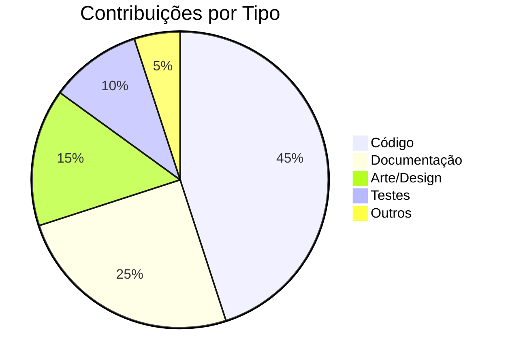

# Comunidade

Bem-vindo à comunidade MadBoss! Aqui você encontra tudo sobre como participar, contribuir e se envolver com o projeto.

## Nossa Missão

Criar um ambiente acolhedor e inclusivo onde desenvolvedores de todos os níveis possam aprender, contribuir e crescer juntos no desenvolvimento de jogos open source.

## Como Participar

### 💬 Canais de Comunicação

- **[GitHub Discussions](https://github.com/MadDev/MadBoss/discussions)** - Discussões gerais, dúvidas e ideias
- **[Issues](https://github.com/MadDev/MadBoss/issues)** - Bugs, features e melhorias
- **[Discord](#)** - Chat em tempo real com a comunidade
- **[Forum](#)** - Discussões mais estruturadas

### 🤝 Formas de Contribuir

| Tipo | Descrição | Nível |
|------|-----------|--------|
| 🐛 **Bug Reports** | Relate problemas encontrados | Iniciante |
| 📝 **Documentação** | Melhore nossa wiki | Iniciante |
| 🎨 **Arte/Assets** | Contribua com recursos visuais | Intermediário |
| 🔧 **Código** | Implemente features e correções | Avançado |
| 🧪 **Testes** | Escreva e execute testes | Intermediário |
| 🌍 **Tradução** | Ajude com internacionalização | Iniciante |

## Diretrizes da Comunidade

### 🛡️ [Código de Conduta](code-of-conduct.md)

Nosso código de conduta estabelece as expectativas para participação na comunidade.

### 📋 [Guia de Contribuição](contributing-guide.md)

Processo completo para contribuir com código, documentação e outros recursos.

### 🐛 [Issues e Bugs](issues-bugs.md)

Como reportar problemas de forma efetiva e útil.

### 🗺️ [Roadmap](roadmap.md)

Planejamento e visão futura do projeto.

## Eventos e Atividades

### 📅 Reuniões Regulares

- **Weekly Standup**: Segundas às 19h (horário de Brasília)
- **Code Review Sessions**: Quartas às 20h
- **Design Meetings**: Sextas às 18h

### 🏆 Reconhecimento

Reconhecemos contribuições através de:

- **Hall of Fame** - Contribuidores destacados
- **Badges** - Conquistas por tipo de contribuição
- **Certificates** - Certificados de participação

## Recursos para Novatos

### 🎓 Primeiros Passos

1. **[Instalação](../getting-started/installation.md)** - Configure seu ambiente
2. **[Primeiro Setup](../getting-started/first-setup.md)** - Entenda o projeto
3. **[Tutoriais](../tutorials/index.md)** - Aprenda fazendo

### 🏷️ Issues para Iniciantes

Procure por issues marcadas com:

- `good first issue` - Perfeitas para começar
- `documentation` - Melhorias na documentação
- `help wanted` - Precisamos de ajuda
- `beginner-friendly` - Amigáveis para iniciantes

### 🎯 Mentoria

Temos um programa de mentoria onde desenvolvedores experientes ajudam novatos:

- **Pareamento de mentor/mentorado**
- **Sessões de pair programming**
- **Code reviews educativos**
- **Workshops técnicos**

## Estatísticas da Comunidade

## Time Principal

### Mantenedores

- **@professor** - Professor Orientador
- **@team-lead** - Líder Técnico
- **@docs-maintainer** - Responsável pela Documentação

### Contribuidores Ativos

Veja todos os [contribuidores](https://github.com/MadDev/MadBoss/graphs/contributors) no GitHub.

## Recursos Externos

### Aprendizado

- **[Godot Documentation](https://docs.godotengine.org/)** - Documentação oficial
- **[GDScript Style Guide](https://docs.godotengine.org/en/stable/tutorials/scripting/gdscript/gdscript_styleguide.html)** - Guia de estilo oficial
- **[Git Handbook](https://guides.github.com/introduction/git-handbook/)** - Guia de Git

### Inspiração

- **[Awesome Godot](https://github.com/godotengine/awesome-godot)** - Recursos incríveis para Godot
- **[Open Source Games](https://osgameclones.com/)** - Jogos open source
- **[Indie Game Development](https://www.reddit.com/r/gamedev/)** - Comunidade de desenvolvimento

## Feedback e Sugestões

Sua opinião é importante! Entre em contato:

- **Geral**: [discussions](https://github.com/MadDev/MadBoss/discussions)
- **Bugs**: [issues](https://github.com/MadDev/MadBoss/issues)
- **Features**: [feature requests](https://github.com/MadDev/MadBoss/issues/new?template=feature_request.md)
- **Privado**: email@exemplo.com

!!! success "Junte-se a nós!"
    A comunidade MadBoss está sempre crescendo. Seja parte desta jornada incrível de criar um jogo open source juntos! 🎮✨
