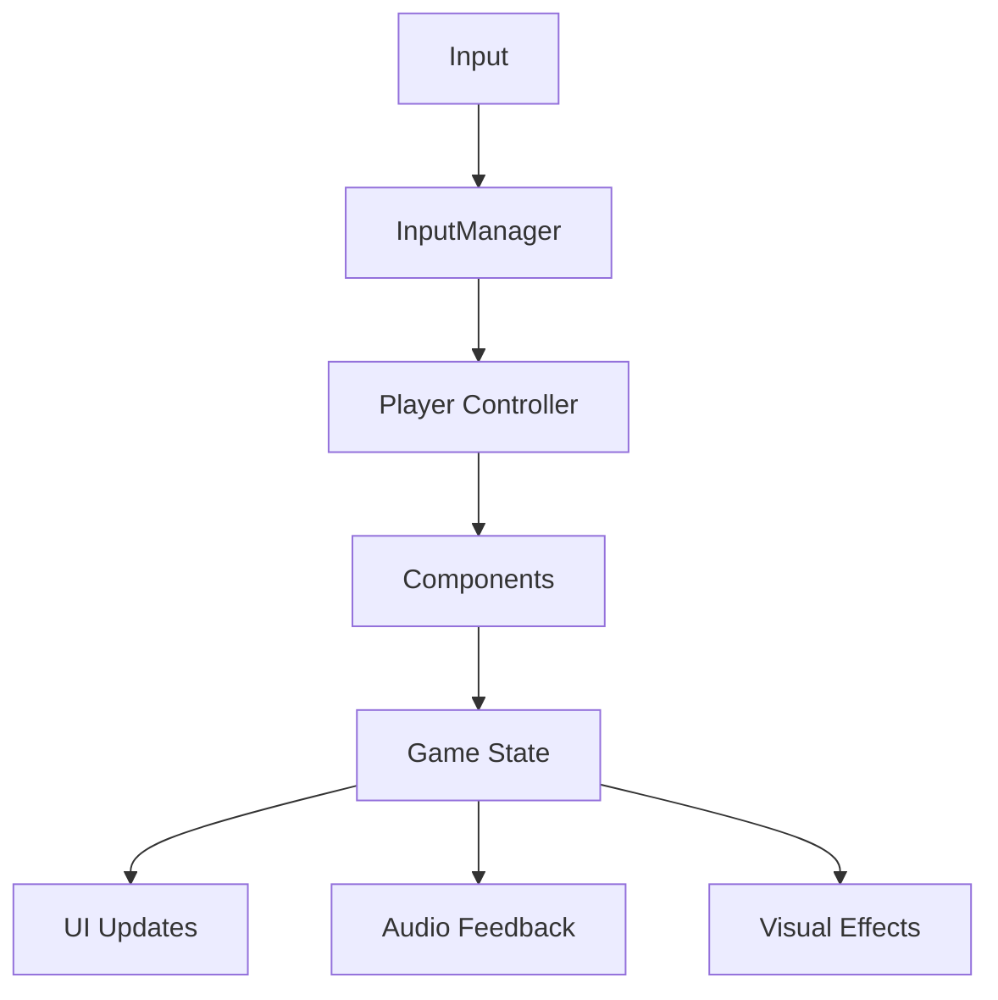

# Arquitetura do MadBoss

Esta documentação descreve a arquitetura geral do projeto MadBoss, incluindo estrutura de código, padrões utilizados e organização dos componentes.

## Visão Geral

O MadBoss segue uma arquitetura modular baseada nos padrões recomendados pelo Godot, com foco em:

- **Separação de responsabilidades**
- **Baixo acoplamento**
- **Alta coesão**
- **Facilidade de manutenção**
- **Testabilidade**

## Estrutura do Projeto Godot

```
game/
├── 📁 scenes/                  # Cenas principais
│   ├── 📁 characters/         # Personagens (Player, NPCs, Inimigos)
│   ├── 📁 environments/       # Cenários e níveis
│   ├── 📁 ui/                # Interface do usuário
│   ├── 📁 effects/           # Efeitos visuais e partículas
│   └── 📄 Main.tscn          # Cena principal
├── 📁 scripts/                 # Scripts GDScript
│   ├── 📁 autoload/          # Singletons/AutoLoad
│   ├── 📁 components/        # Componentes reutilizáveis
│   ├── 📁 managers/          # Gerenciadores de sistema
│   ├── 📁 entities/          # Classes de entidades
│   └── 📁 utils/             # Utilitários e helpers
├── 📁 assets/                  # Recursos do jogo
│   ├── 📁 sprites/           # Imagens e texturas
│   ├── 📁 audio/             # Sons e música
│   ├── 📁 fonts/             # Fontes
│   └── 📁 data/              # Dados de configuração
├── 📁 addons/                  # Plugins e addons
└── 📄 project.godot           # Configuração do projeto
```

## Padrões Arquiteturais

### 1. Component System

Utilizamos um sistema baseado em componentes para maximizar a reutilização:

```gdscript
# Exemplo: HealthComponent.gd
extends Node
class_name HealthComponent

signal health_changed(new_health, max_health)
signal health_depleted

@export var max_health: int = 100
var current_health: int

func _ready():
    current_health = max_health

func take_damage(amount: int):
    current_health = max(0, current_health - amount)
    health_changed.emit(current_health, max_health)
    
    if current_health == 0:
        health_depleted.emit()
```

### 2. Singleton Pattern (AutoLoad)

Gerenciadores globais para sistemas que precisam persistir:

```gdscript
# GameManager.gd (AutoLoad)
extends Node

signal game_paused
signal game_resumed

var is_paused: bool = false
var current_level: String = ""
var player_data: PlayerData

func pause_game():
    get_tree().paused = true
    is_paused = true
    game_paused.emit()
```

### 3. Observer Pattern

Comunicação entre componentes através de signals:

```gdscript
# Player.gd
extends CharacterBody2D

@onready var health_component = $HealthComponent

func _ready():
    health_component.health_depleted.connect(_on_health_depleted)

func _on_health_depleted():
    # Lógica de morte do jogador
    pass
```

## Camadas da Arquitetura

### 🎮 Game Layer
**Responsabilidade**: Lógica específica do jogo

- Mecânicas de gameplay
- Regras do jogo
- Estados do jogo

### 🏗️ System Layer
**Responsabilidade**: Sistemas centrais

- Input Manager
- Audio Manager
- Save/Load Manager
- Scene Manager

### 🧩 Component Layer
**Responsabilidade**: Componentes reutilizáveis

- Health Component
- Movement Component
- Inventory Component
- Animation Component

### 🎨 Presentation Layer
**Responsabilidade**: Interface e feedback visual

- UI Controllers
- Visual Effects
- Sound Effects
- Animations

## Gerenciadores de Sistema

### GameManager (Singleton)
- Estado geral do jogo
- Transições entre cenas
- Pause/Resume
- Game Over conditions

### InputManager (Singleton)
- Mapeamento de inputs
- Input buffering
- Device management
- Accessibility options

### AudioManager (Singleton)
- Controle de volume
- Music transitions
- Sound effect pooling
- Audio settings

### SaveManager (Singleton)
- Serialização de dados
- Save/Load operations
- Multiple save slots
- Data validation

## Fluxo de Dados



## Padrões de Nomenclatura

### Arquivos e Pastas
- **PascalCase**: Classes e cenas (`PlayerController.gd`, `MainMenu.tscn`)
- **snake_case**: Recursos e dados (`player_sprite.png`, `level_data.json`)
- **kebab-case**: Pastas (`ui-components/`, `character-sprites/`)

### Código GDScript
- **PascalCase**: Classes e tipos (`class_name PlayerData`)
- **snake_case**: Variáveis e funções (`current_health`, `take_damage()`)
- **UPPER_CASE**: Constantes (`MAX_SPEED`, `DEFAULT_HEALTH`)

## Organização de Recursos

### Sprites e Texturas
```
assets/sprites/
├── characters/
│   ├── player/
│   ├── enemies/
│   └── npcs/
├── environment/
│   ├── tiles/
│   ├── objects/
│   └── backgrounds/
└── ui/
    ├── buttons/
    ├── icons/
    └── panels/
```

### Áudio
```
assets/audio/
├── music/
│   ├── background/
│   ├── menu/
│   └── boss/
├── sfx/
│   ├── player/
│   ├── enemies/
│   └── environment/
└── voice/
    └── narration/
```

## Sistema de Configuração

### Project Settings
- Input Map configurado
- Layer Names definidas
- Audio Bus Layout
- Rendering settings

### Game Data
```gdscript
# GameConfig.gd
extends Resource
class_name GameConfig

@export var player_speed: float = 200.0
@export var enemy_spawn_rate: float = 2.0
@export var level_progression: Array[String] = []
```

## Testes e Debug

### Debug Tools
- Console de debug
- Performance monitor
- Entity inspector
- State visualizer

### Test Structure
```
tests/
├── unit/           # Testes unitários
├── integration/    # Testes de integração
└── end_to_end/     # Testes E2E
```

## Performance e Otimização

### Object Pooling
```gdscript
# BulletPool.gd
extends Node

var bullet_scene = preload("res://scenes/Bullet.tscn")
var pool: Array[Bullet] = []
var active_bullets: Array[Bullet] = []

func get_bullet() -> Bullet:
    if pool.is_empty():
        return bullet_scene.instantiate()
    return pool.pop_back()
```

### Scene Management
- Preload de cenas críticas
- Lazy loading para recursos grandes
- Unload de recursos não utilizados

## Próximos Passos

1. **Implementar** os gerenciadores base
2. **Criar** componentes fundamentais
3. **Definir** interfaces padronizadas
4. **Configurar** sistema de testes
5. **Documentar** APIs dos componentes

!!! tip "Dica"
    Esta arquitetura é evolutiva. Conforme o projeto cresce, novos padrões podem ser introduzidos para atender necessidades específicas.

!!! warning "Importante"
    Sempre siga os padrões estabelecidos. Se precisar modificar a arquitetura, discuta com a equipe primeiro.
