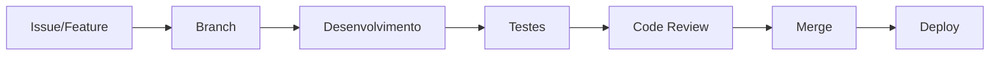

# Desenvolvimento

Esta seção contém toda a documentação técnica para desenvolvedores do MadBoss.

## Visão Geral

O desenvolvimento do MadBoss segue princípios de software livre e boas práticas de engenharia de software, incluindo:

- **Arquitetura limpa e modular**
- **Padrões de código consistentes**
- **Documentação abrangente**
- **Testes automatizados**
- **Controle de versão eficiente**

## Estrutura da Documentação

### 🏗️ [Arquitetura](architecture.md)
Entenda a estrutura geral do projeto, padrões arquiteturais utilizados e como os diferentes componentes se relacionam.

### 📝 [Padrões de Código](coding-standards.md)
Convenções de nomenclatura, formatação e organização do código para manter a consistência em todo o projeto.

### 🎯 [GDScript Guidelines](gdscript-guidelines.md)
Diretrizes específicas para desenvolvimento em GDScript, incluindo boas práticas e padrões do Godot.

### 🔄 [Sistema de Versionamento](versioning.md)
Como utilizamos Git, estratégias de branching, convenções de commit e processo de release.

## Fluxo de Desenvolvimento

## Tecnologias Utilizadas

| Categoria | Tecnologia | Versão | Propósito |
|-----------|------------|--------|-----------|
| **Engine** | Godot | 4.4 | Engine principal |
| **Linguagem** | GDScript | - | Scripts do jogo |
| **Controle de Versão** | Git | - | Versionamento |
| **CI/CD** | GitHub Actions | - | Automação |
| **Documentação** | MkDocs | - | Wiki/Docs |

## Primeiros Passos

1. **Configure seu ambiente** seguindo o [guia de instalação](../getting-started/installation.md)
2. **Entenda a arquitetura** lendo a [documentação de arquitetura](architecture.md)
3. **Familiarize-se com os padrões** nos [padrões de código](coding-standards.md)
4. **Pratique com os tutoriais** na seção de [tutoriais](../tutorials/index.md)

## Contribuindo com o Desenvolvimento

Antes de começar a contribuir com código:

- [ ] Leia o [Código de Conduta](../community/code-of-conduct.md)
- [ ] Entenda nosso [processo de contribuição](../community/contributing-guide.md)
- [ ] Configure as [ferramentas de desenvolvimento](../tools/index.md)
- [ ] Execute os [testes](../tools/testing.md) localmente

!!! tip "Dica para Iniciantes"
    Se você é novo no desenvolvimento de jogos ou no Godot, comece pelos [tutoriais](../tutorials/index.md) que cobrem conceitos básicos antes de mergulhar no código principal.

!!! warning "Importante"
    Sempre crie uma branch para suas mudanças e abra um Pull Request. Nunca commite diretamente na branch `main`.
