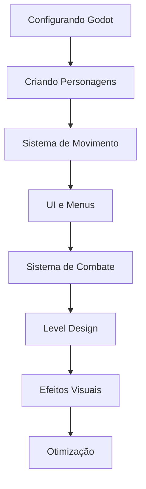

# Tutoriais

Aprenda a desenvolver no MadBoss através de tutoriais práticos e passo a passo.

## Visão Geral

Esta seção contém tutoriais organizados do básico ao avançado, cobrindo todos os aspectos do desenvolvimento do jogo.

## 🎯 Categorias

### 🔧 **Configuração e Ambiente**

- **[Configurando Godot](godot-setup.md)** - Setup completo do ambiente
- **[Configuração do Projeto](project-setup.md)** - Estrutura e organização
- **[Ferramentas de Debug](debug-tools.md)** - Como debugar eficientemente

### 👾 **Desenvolvimento de Gameplay**

- **[Criando Personagens](character-creation.md)** - Sistema de personagens
- **[Sistema de Movimento](movement-system.md)** - Controles e física
- **[Sistema de Combate](combat-system.md)** - Mecânicas de luta
- **[Sistema de Inventário](inventory-system.md)** - Gerenciamento de itens

### 🎨 **Interface e UX**

- **[UI e Menus](ui-menus.md)** - Criando interfaces
- **[HUD do Jogo](game-hud.md)** - Interface durante o jogo
- **[Menus Dinâmicos](dynamic-menus.md)** - Menus responsivos

### 🌍 **Mundo e Ambiente**

- **[Level Design](level-design.md)** - Criando níveis
- **[Sistema de Câmera](camera-system.md)** - Controle de câmera
- **[Efeitos Visuais](visual-effects.md)** - Partículas e shaders

## 📚 Níveis de Dificuldade

| Nível | Descrição | Pré-requisitos |
|-------|-----------|----------------|
| 🟢 **Iniciante** | Conceitos básicos | Conhecimento básico de Godot |
| 🟡 **Intermediário** | Sistemas mais complexos | Tutoriais iniciantes completos |
| 🔴 **Avançado** | Implementações complexas | Experiência com GDScript |

## 🗺️ Trilha de Aprendizado Recomendada

## 🎮 Projetos Práticos

### Projeto 1: Personagem Básico
**Nível**: 🟢 Iniciante  
**Duração**: 2-3 horas  
**Objetivo**: Criar um personagem que se move pela tela

### Projeto 2: Sistema de Combate Simples
**Nível**: 🟡 Intermediário  
**Duração**: 4-6 horas  
**Objetivo**: Implementar ataques básicos e vida

### Projeto 3: Mini-Jogo Completo
**Nível**: 🔴 Avançado  
**Duração**: 10-15 horas  
**Objetivo**: Jogo completo com múltiplas mecânicas

## 📝 Formato dos Tutoriais

Todos os tutoriais seguem esta estrutura:

1. **Objetivo** - O que você vai aprender
2. **Pré-requisitos** - O que você precisa saber antes
3. **Materiais** - Assets e arquivos necessários
4. **Passo a passo** - Instruções detalhadas
5. **Código completo** - Implementação final
6. **Exercícios** - Prática adicional
7. **Próximos passos** - O que estudar em seguida

## 🛠️ Recursos Adicionais

### Assets para Prática

- **[Sprites de Exemplo](assets/sprites/)** - Personagens e objetos
- **[Sons e Música](assets/audio/)** - Efeitos sonoros
- **[Mapas de Teste](assets/maps/)** - Cenários para testar

### Ferramentas Úteis

- **[Godot Asset Library](https://godotengine.org/asset-library/asset)** - Assets da comunidade
- **[Aseprite](https://www.aseprite.org/)** - Editor de pixel art
- **[Audacity](https://www.audacityteam.org/)** - Editor de áudio

## 🤝 Contribuindo com Tutoriais

Quer criar um tutorial? Siga nosso [guia para autores](tutorial-authoring-guide.md):

- Use linguagem clara e acessível
- Inclua capturas de tela
- Forneça código completo
- Teste tudo antes de publicar

## ❓ Dúvidas e Suporte

- **[FAQ](../community/faq.md)** - Perguntas frequentes
- **[Discord](https://discord.gg/madboss)** - Chat da comunidade
- **[Issues](https://github.com/MadDev/MadBoss/issues)** - Reportar problemas

!!! tip "Dica de Estudo"
    Aprenda fazendo! Execute cada tutorial e experimente modificar o código para entender melhor como funciona.

!!! warning "Versões"
    Todos os tutoriais são testados com Godot 4.4. Versões diferentes podem ter pequenas diferenças na interface.
